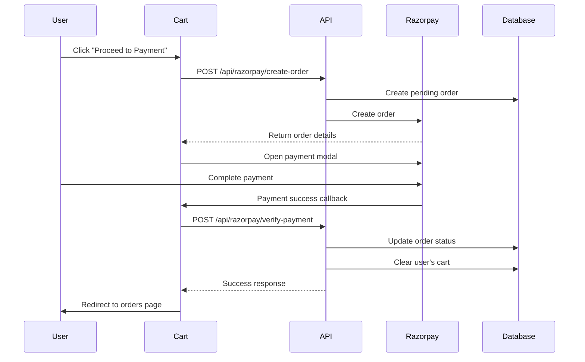

# Cart Implementation Summary

## Overview
A complete shopping cart system has been implemented with full checkout functionality integrated with Razorpay payments.

## Features Implemented

### 1. Cart API Routes
Created comprehensive API endpoints for cart operations:

#### `/app/api/cart/route.ts`
- **GET**: Fetch user's cart items with product details using MongoDB aggregation
- **POST**: Add items to cart with stock validation and duplicate handling

#### `/app/api/cart/[productId]/route.ts`
- **PUT**: Update cart item quantity
- **DELETE**: Remove item from cart

#### `/app/api/cart/clear/route.ts`
- **DELETE**: Clear entire cart

All routes include:
- Authentication checks using `getAuthUser()`
- MongoDB integration
- Error handling
- Stock validation

### 2. Cart Page (`/app/cart/page.tsx`)
A beautiful, responsive cart page with:

**Features:**
- Display all cart items with images, names, prices
- Quantity controls (increase/decrease)
- Remove item functionality
- Real-time order summary with total calculation
- Integrated Razorpay checkout
- Multi-language support (English/Hindi)
- Empty cart state with "Browse Products" CTA
- Loading states and error handling

**Checkout Flow:**
1. Click "Proceed to Payment"
2. Create Razorpay order via `/api/razorpay/create-order`
3. Open Razorpay payment modal
4. On successful payment, verify via `/api/razorpay/verify-payment`
5. Clear cart automatically
6. Redirect to orders page

### 3. Cart Auto-Clear After Purchase
Updated `/app/api/razorpay/verify-payment/route.ts` to:
- Clear cart items from database after successful payment verification
- Ensure cart is empty for the user after order completion

### 4. Navigation Updates
Updated `/components/layout/navbar.tsx` to:
- Show cart icon with item count badge in desktop view
- Display cart link in mobile menu
- Real-time cart count updates

### 5. Type System Updates
Updated `/components/providers/cart-provider.tsx` to:
- Use string IDs for MongoDB ObjectId compatibility
- Update all cart operations to use string product IDs
- Maintain type safety throughout the application

## User Flow

1. **Browse Products** → User views products on `/products` page
2. **Add to Cart** → Click "Add to Cart" on any product
3. **View Cart** → Click cart icon in navbar (shows item count)
4. **Manage Cart** → Adjust quantities or remove items on `/cart` page
5. **Checkout** → Click "Proceed to Payment"
6. **Payment** → Complete payment via Razorpay
7. **Order Complete** → Cart is automatically cleared, redirected to `/orders`

## Database Schema

### Cart Collection (MongoDB)
```javascript
{
  _id: ObjectId,
  user_id: string,
  product_id: ObjectId,
  quantity: number,
  created_at: Date,
  updated_at: Date
}
```

### Cart Items Response
```javascript
{
  id: string,
  product_id: string,
  name: string,
  name_hi?: string,
  price: number,
  quantity: number,
  image_url?: string
}
```

## Security Features
- All cart operations require authentication
- Product stock validation on add to cart
- JWT token verification for all requests
- Payment signature verification for orders

## UI/UX Highlights
- **Responsive Design**: Works on mobile, tablet, and desktop
- **Real-time Updates**: Cart count updates immediately
- **Loading States**: Smooth loading indicators
- **Error Handling**: User-friendly error messages
- **Empty States**: Helpful messages and CTAs
- **Accessibility**: Proper ARIA labels and keyboard navigation

## Integration Points

### With Existing Systems
1. **Authentication**: Uses existing auth context and JWT tokens
2. **Products**: Integrates with product catalog
3. **Orders**: Creates orders on successful payment
4. **Payments**: Full Razorpay integration
5. **Language**: Supports English and Hindi

### Provider Dependencies
- `AuthProvider`: User authentication
- `CartProvider`: Cart state management
- `LanguageProvider`: Multi-language support

## Testing Checklist

### Manual Testing
- [ ] Add product to cart
- [ ] View cart page
- [ ] Update quantity (increase/decrease)
- [ ] Remove item from cart
- [ ] Checkout with payment
- [ ] Verify cart cleared after payment
- [ ] Check order appears in `/orders`
- [ ] Test on mobile and desktop
- [ ] Test language switching

### Edge Cases
- [ ] Add to cart when not logged in (shows login prompt)
- [ ] Add product with insufficient stock
- [ ] Payment failure handling
- [ ] Empty cart state
- [ ] Network error handling

## API Endpoints Summary

| Method | Endpoint | Description | Auth Required |
|--------|----------|-------------|---------------|
| GET | `/api/cart` | Get user's cart items | Yes |
| POST | `/api/cart` | Add item to cart | Yes |
| PUT | `/api/cart/[productId]` | Update item quantity | Yes |
| DELETE | `/api/cart/[productId]` | Remove item from cart | Yes |
| DELETE | `/api/cart/clear` | Clear entire cart | Yes |

## Payment Flow



## Files Created/Modified

### Created
- `/app/api/cart/route.ts`
- `/app/api/cart/[productId]/route.ts`
- `/app/api/cart/clear/route.ts`
- `/app/cart/page.tsx`
- `/CART_IMPLEMENTATION.md`

### Modified
- `/app/api/razorpay/verify-payment/route.ts` - Added cart clearing logic
- `/components/layout/navbar.tsx` - Added cart link and badge
- `/components/providers/cart-provider.tsx` - Updated type definitions
- `/components/products/product-card.tsx` - Updated for string IDs

## Future Enhancements (Optional)

1. **Wishlist**: Save items for later
2. **Cart Persistence**: Save cart for guest users
3. **Coupon Codes**: Apply discounts
4. **Bulk Actions**: Clear cart, select multiple items
5. **Cart Sharing**: Share cart via link
6. **Stock Warnings**: Alert when stock is low
7. **Related Products**: Suggest items in cart page
8. **Cart Analytics**: Track abandoned carts

## Conclusion

The cart system is fully functional with:
- ✅ Add/remove/update cart items
- ✅ Beautiful, responsive UI
- ✅ Complete payment integration
- ✅ Automatic cart clearing after purchase
- ✅ Multi-language support
- ✅ Proper error handling
- ✅ Type-safe implementation

The cart route `/cart` is now live and ready for use!

